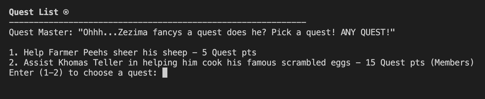

# BashScape



## Overview:

- An RPG game based on the classic MMORPG, RuneScape, built entirely on Python where players can level up their stats, experience quests, and unlock milestones.
## Languages Used:

- Python

## Instructions: (Mac)
- <a href="https://realpython.com/installing-python/#how-to-install-from-homebrew" target="_blank" rel="noreferrer">CLICK HERE FOR PYTHON INSTALLATION INSTRUCTIONS FOR ALL</a>
- 1.) Install python on your computer via Homebrew. To install Homebrew, open your terminal and paste the text below into your terminal and press enter.
```
/bin/bash -c "$(curl -fsSL https://raw.githubusercontent.com/Homebrew/install/HEAD/install.sh)"
```
- 2.) Enter your Mac password when the terminal asks.
- 3.) Wait for Homebrew to finish installing.
- 4.) Once Homebrew is installed, copy and paste the command below into your terminal. Press enter to run.
```
brew install python3
```

## Run Game:
- 5.) After python installs, clone this repository. To do this, paste the text below into your terminal and press enter.
```
git clone ?????????????
```
- 6.) Inside terminal install these packages for decorative features to show while playing game.
```
pip install colorama
pip install stdiomask
```
- 7.) From here, make sure that you cd into the directory that contains the python_rpg_project.py file
The game can be ran by pasting the text below into your terminal. Press enter.
```
python main.py
```

## Tip(s):
- While in main menu and if you choose to level up, click level up four times or so to reveal a new lvl along with new items you can add to your inventory. 

